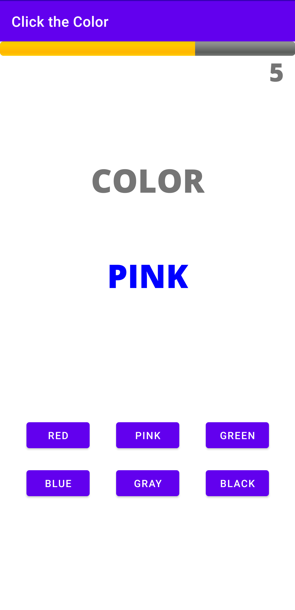
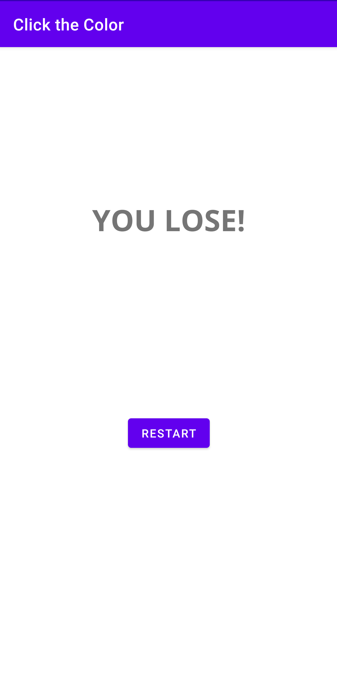

# Click the Color

<!-- ABOUT THE PROJECT -->
## About

A tricky Android game where users either select the color of the text or the color the text is referring to. Built in Android Studio with Kotlin.

<!-- GETTING STARTED -->
## Getting Started

You must have an Android device to run the app. Simply download the apk from the releases and install.

<!-- USAGE EXAMPLES -->
## Usage

This demo video shows the app in action: https://youtu.be/yCUoCNZnsa8

App screenshots are below:

  
  
  
  
  

<!-- CONTACT -->
## Contact

Gaurav Garre: [gauravgarre@gmail.com](mailto:gauravgarre@gmail.com)

Project Link: [https://github.com/gauravgarre/click-the-color](https://github.com/gauravgarre/click-the-color)
